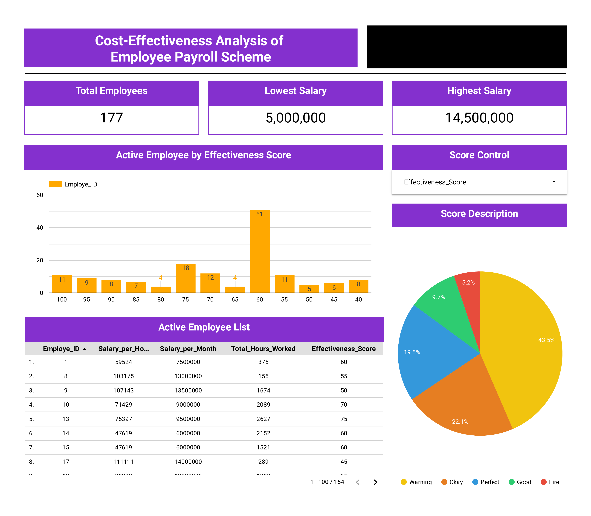

# Cost Effectiveness Analysis of Employee Payroll Scheme
**The Bloom Company** is a fast-growing company in the SaaS industry with over 35.000 users from all over the country, and currently home to more than 1.400 Bloomers. Since its establishment in 2015, **The Bloom Company** has opened office branches in several big cities in Indonesia to accommodate their wide-coverage operations.

In its 7th year, **The Bloom Company** is planning to reassess their budget allocation for their payroll scheme. To make an informed decision, **The Bloom Company**’s Management needs accurate Data on Bloomers’ salary per hour based on the number of Bloomers working in each **The Bloom Company** office branch per month.

My role involves analyzing whether **The Bloom Company** current payroll system for Bloomers (**The Bloom Company** employees), which is structured on a monthly basis, is cost-effective in terms of hourly rates. This analysis is conducted for each office branch individually and is performed on a monthly basis.

# SQL
- [Employee That Need To Get Layoff](SQL/Employee-That-Need-To-Get-Layoff.sql)
- [Payroll Scoring Effectiveness](SQL/Payroll-Scoring-Effectiveness.sql)

# Data Visualization
